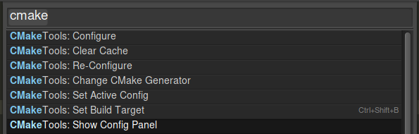

# Cmake Tools

This is a Sublime Text plugin to handle configuration and building of CMake projects.

This project is very much inspired by [CMakeBuilder](https://github.com/rwols/CMakeBuilder).
After using CMakeBuilder and discovering some limitations, this project began as an attempt to try and simplify configuration a bit and to overcome limitations on where project files needed to be placed.

This project also contains a slightly modified copy of [compdb](https://github.com/Sarcasm/compdb) for enhancement of compilation database files. (To import compdb as a sub package its intenal imports needed to be relative). Changes can be viewed on my [fork](https://github.com/Stefantb/compdb/tree/relative-imports).

### Use
The command palette is your friend:



*Before anything else you will need to have a project open, this plugin works by keeping its information in the project file.*

To get started use the `Set Active Config` command and choose `create new` choosing a name for it.
This will insert the following template into your project file:

``` json
"cmake_tools":
{
    "configurations":
    [
        {
            "arguments":
            {
                "CMAKE_EXPORT_COMPILE_COMMANDS": true
            },
            "build_folder": "${folder}/cmake-build-{name}-{configuration}",
            "configuration": "Debug",
            "generator": "Unix Makefiles",
            "name": "MyConfig",
            "source_folder": "${folder}"
        }
    ],
```
You can add as many configurations as you wish, one for Debug, Release, etc.


#### Important Fields:

1. `"source_folder": "${folder}"` Specifies the folder containing the `CMakeLists.txt` in its root, defaulting to the project root. Change this if this is not where `CMakeLists.txt` lives. Note [Standard Sublime text variables](http://docs.sublimetext.info/en/latest/reference/build_systems/configuration.html#build-system-variables).

2. `"build_folder": "${folder}/cmake-build-{name}-{configuration}",` Sets the build directory cmake will generate as the rendering of this template, you can edit the template or hard code a directory if you want.
The template can be a mix of [Standard Sublime text variables](http://docs.sublimetext.info/en/latest/reference/build_systems/configuration.html#build-system-variables) and keys from the configuration itself, for which the `$` is ommited.

3. `"arguments":` Arguments that you would like to pass to CMake when configuring. This could for example include `CMAKE_TOOLCHAIN_FILE`. Note that `CMAKE_BUILD_TYPE` is implicitly added from the configuration property. You can view the configuration parameters on the `Config Panel` when you configure and you can always retreive the last configuration output by opening the `Config Panel` from the command pallete. 

### Build Targets

Build targets are automatically retreived from cmake. To build, choose the CMakeTools build system and your normal build keybinding will work (`ctrl+b`). The first time you build you will be confronted with a quick panel to choose the build target you wish to build.

To switch between build targets you can use the command palette, but I recomend adding the key `"project_use_cmake_tools_keybindings": true ` to the project settings, and add the following to your keybindings:

``` json
{
    "keys": ["ctrl+shift+b"],
    "command": "cmaketools_build", "args":{"choose_target": true},
    "context": [
        { "key": "setting.project_use_cmake_tools_keybindings", "operator": "equal", "operand": true },
    ]
}
```

### Global settings

The package comes with some default settings `Preferences->Package Settings->CMakeTools` like the following:

```
{
    "cmake_binary" : "cmake",
    "copy_compile_commands_dir": "${folder}",
    "enhance_compile_commands_with_header_info": true,
    "auto_update_EasyClangComplete_compile_commands_location": false
}
```

These settings can be overriden on the global level, the project level or the configuration level. When the settings are accessed they are searched for in the current configuration, then the project and finally globally. The first definition wins.